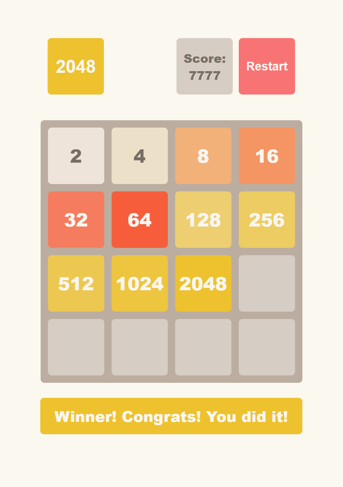

# 2048

A browser-based implementation of the classic 2048 puzzle game — built from scratch with vanilla JavaScript, no frameworks.



## 🔗 Live Demo

**[drdakka.github.io/2k48](https://drdakka.github.io/2k48/)**

---

## About

Slide numbered tiles on a 4×4 grid to combine matching values. Reach the **2048** tile to win. If the board fills up with no moves left — you lose.

### Rules

- Arrow keys move all tiles in a direction simultaneously
- Two tiles with the same value merge into one (their sum)
- Each tile can only merge once per move
- After each move a new tile (2 or 4) appears in a random empty cell — 4 appears with 10% probability
- Score increases by the value of every merge

---

## Features

- Smooth **CSS tile-slide animations** with per-tile movement tracking
- **Pop-in** animation for new tiles, **bounce** animation on merge
- Win / lose detection with overlay messages
- Fully keyboard-driven (arrow keys)
- Score counter

---

## Tech Stack

Vanilla JavaScript (ES6+, classes, modules)
Styles: SCSS 
Unit tests: Jest 
E2E tests: Cypress 

---

## Getting Started

```bash
git clone https://github.com/drdakka/2k48.git
cd 2k48
npm install
npm start
```

Open [http://localhost:1234](http://localhost:1234) in your browser.

### Available Scripts


`npm start` Dev server at localhost:1234 
`npm run build` Production build 
`npm test` Jest unit tests
`npm run cy:open` Cypress test runner (interactive)
`npm run cy:run` Cypress tests (headless)
`npm run lint` ESLint + Stylelint
`npm run format` Prettier

---

## Project Structure

```
src/
  modules/
    Game.class.js     # Game logic — state, moves, merge, win/lose
  scripts/
    main.js           # DOM rendering and animation engine
  styles/
    main.scss         # Styles and keyframe animations
  index.html
tests/
  Game.class.test.js  # Jest unit tests (move logic, scoring, state)
cypress/
  integration/
    js2048Game.spec.js  # Cypress E2E tests
```

---
